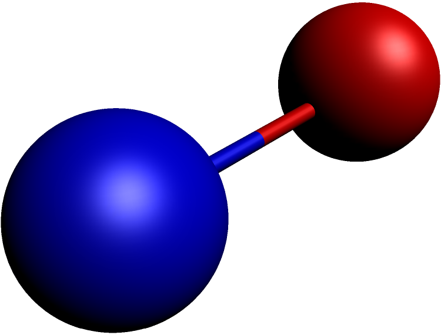

/// \mainpage
# ASY-ATOMS #

This package is a tool in order to render
molecular structures in using the Asymptote program.

## Installation ##

Take the files in the <code>dist</code> director and copy them in
your project directory or if you want to install it system-wide
just copy the files into

### Linux ###
<code>/usr/share/asymptote/</code>

### Windows ###

TODO

## Quick start ##

~~~c
import atoms;
unitsize(1cm);
currentprojection = perspective(1,1,1);
settings.prc       = false;
settings.render    = 10; //quality
settings.outformat = "png"; //output 

real bond_radius = 3.0;
real radius_scale = 0.2;

Atom h_1 = Atom("H", (-1,0,0));
Atom h_2 = Atom("H", (1,0,0));

h_1.color = red;
h_2.color = blue;

h_1.draw(true);
h_2.draw(true);

Bond(h_1,h_2).draw(radius=bond_radius);
~~~

And now you could do

<code>asy h2.asy</code> or if you want interactive
<code>asy -batchView h2.asy</code>

## Whish list ##

  * Volumetric data!!!!!!!

## Example ##

