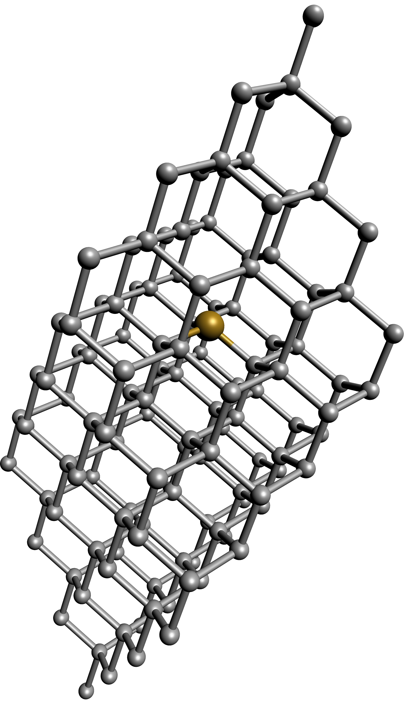

# ASY-ATOMS #

This package is a tool in order to render
molecular structures in using the Asymptote program.

## Installation ##

Take the files in the <code>src</code> director and copy them in

### Linux ###
<code>/usr/share/asymptote/</code>

### Windows ###

TODO

## Example ##

